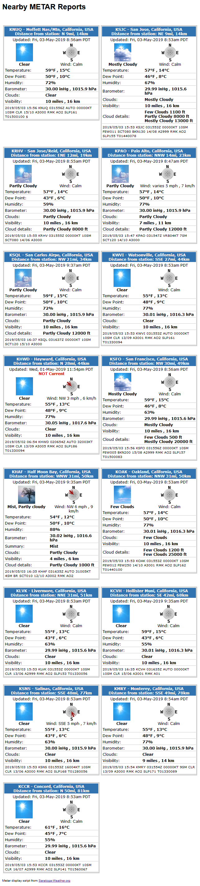

# METAR conditions display

This package of scripts is designed for standalone (outside the [Saratoga AJAX/PHP template set](https://saratoga-weather.org/wxtemplates/index.php)) use. The equivalent function is already built in to the _wxmetar.php_ page in the template set.

It uses two of the built-in functions from the template set:  
  **get-metar-conditions-inc.php**  
  **include-metar-display.php**  
so to have easy maintenance for future releases of those two scripts, it is strongly recommended you **not** modify them. All needed customization can be performed in the **metar-display.php** script.

## Settings inside metar-display.php sample page

```
// Customize this list with your nearby METARs by
// using http://saratoga-weather.org/wxtemplates/find-metar.php to create the list below

$MetarList = array( // set this list to your local METARs
// Metar(ICAO) | Name of station | dist-mi | dist-km | direction |
  'KNUQ|Moffett Nas/Mtn, California, USA|9|14|N|', // lat=37.4000,long=-122.0500, elev=12, dated=28-FEB-12
  'KSJC|San Jose, California, USA|9|14|NE|', // lat=37.3667,long=-121.9167, elev=24, dated=28-FEB-12
  'KRHV|San Jose/Reid, California, USA|12|19|ENE|', // lat=37.3167,long=-121.8167, elev=41, dated=28-FEB-12
  'KPAO|Palo Alto, California, USA|14|23|NNW|', // lat=37.4667,long=-122.1167, elev=2, dated=28-FEB-12
  'KSQL|San Carlos Airpo, California, USA|21|34|NW|', // lat=37.5167,long=-122.2500, elev=1, dated=28-FEB-12
  'KWVI|Watsonville, California, USA|27|44|SSE|', // lat=36.9333,long=-121.7833, elev=43, dated=28-FEB-12
  'KHWD|Hayward, California, USA|28|44|N|', // lat=37.6667,long=-122.1167, elev=21, dated=28-FEB-12
  'KSFO|San Francisco, California, USA|30|49|NW|', // lat=37.6167,long=-122.3667, elev=3, dated=28-FEB-12
  'KHAF|Half Moon Bay, California, USA|31|50|WNW|', // lat=37.5167,long=-122.5000, elev=21, dated=28-FEB-12
  'KOAK|Oakland, California, USA|31|50|NNW|', // lat=37.7000,long=-122.2167, elev=26, dated=28-FEB-12
  'KLVK|Livermore, California, USA|31|51|NNE|', // lat=37.7000,long=-121.8167, elev=117, dated=28-FEB-12
  'KCVH|Hollister Muni, California, USA|42|68|SE|', // lat=36.9000,long=-121.4167, elev=70, dated=28-FEB-12
  'KSNS|Salinas, California, USA|48|77|SSE|', // lat=36.6667,long=-121.6000, elev=30, dated=28-FEB-12
  'KMRY|Monterey, California, USA|49|78|SSE|', // lat=36.5833,long=-121.8500, elev=66, dated=28-FEB-12
  'KCCR|Concord, California, USA|50|81|N|', // lat=38.0000,long=-122.0500, elev=11, dated=28-FEB-12
// list generated Wed, 09-Jan-2013 4:39pm PST at http://saratoga-weather.org/wxtemplates/find-metar.php
);
$maxAge = 75*60; // max age for metar in seconds = 75 minutes
#
$SITE['cacheFileDir']   =  './cache/';   // directory to use for scripts cache files .. use './' for doc.root.dir
$SITE['tz'] 			= 'America/Los_Angeles'; //NOTE: this *MUST* be set correctly to
// translate UTC times to your LOCAL time for the displays.
//  http://us.php.net/manual/en/timezones.php  has the list of timezone names
//  pick the one that is closest to your location and put in $SITE['tz'] like:
//    $SITE['tz'] = 'America/Los_Angeles';  // or
//    $SITE['tz'] = 'Europe/Brussels';
$SITE['timeFormat'] = 'D, d-M-Y g:ia T';  // Day, 31-Mar-2006 6:35pm Tz  (USA Style)
$SITE['latitude']		= '37.27153397';    //North=positive, South=negative decimal degrees
$SITE['longitude']		= '-122.02274323';  //East=positive, West=negative decimal degrees

$condIconDir = './metar-images/';  // directory for metar-images with trailing slash
$SITE['fcsticonstype'] = '.jpg'; // default type='.jpg'
#                                // use '.gif' for animated icons from # http://www.meteotreviglio.com/
$SITE['uomTemp'] = '°F';  // ='°C', ='°F'
$SITE['uomBaro'] = ' inHg';   // =' hPa', =' inHg'
$SITE['uomWind'] = ' mph';    // =' km/h', =' mph'
$SITE['uomRain'] = ' in';     // =' mm', =' in'
$SITE['uomDistance'] = ' mi'; // =' mi' or =' km'
// end of customizations
```
<dl>

<dt>**$MetarList = array( ... );**</dt>

<dd>This array of elements controls which METAR sites will be displayed. Generate this list from the **[find-metar](/wxtemplates/find-metar.php)** utility and copy the customized output to replace the contents of the sample above.</dd>

<dt>**$maxAge**</dt>

<dd>This is the number of seconds to use to determine the maximum age of the METAR report to display. The default is 75*60 = 75 minutes (which is reasonable given that METAR observations are usually posted hourly).</dd>

<dt>**$SITE['cacheFileDir']**</dt>

<dd>This specifies the directory to use to store the raw METAR observations. The default is './cache/'.</dd>

<dt>**$SITE['tz']**</dt>

<dd>This specifies the valid PHP timezone to use. Visit [http://us.php.net/manual/en/timezones.php](http://us.php.net/manual/en/timezones.php) for the proper value for your timezone.</dd>

<dt>**$SITE['timeFormat']**</dt>

<dd>This specifies the output format for the times displayed. Use the PHP [date format descriptors](http://us.php.net/manual/en/function.date.php) to change this.</dd>

<dt>**$SITE['latitude']**</dt>

<dd>The decimal latitude of your location. use positive number for Northern Hemisphere and negative number for Southern Hemisphere.</dd>

<dt>**$SITE['longitude']**</dt>

<dd>The decimal longitude of your location. Use positive number for East of GMT (Europe, etc) and negative number for West of GMT (Americas, etc).</dd>

<dt>**$condIconDir**</dt>

<dd>This specifies the relative location of the metar-images directory. Default is './metar-images/'</dd>

<dt>**$SITE['fcsticonstype']**</dt>

<dd>This specifies the type of icon to use. Default is '.jpg' for the NOAA-style picture condition icons. Use '.gif' for the animated GIF icons from meteotreviglio.com</dd>

<dt>**$SITE['uomTemp']**</dt>

<dd>This specifies the units for temperature display. Valid values are:  
='\&amp;deg;C' for Centigrade (will also cause cloud heights to display in meters)  
='&amp;deg;F' for Fahrenheit (will also cause cloud heights to display in feet and temperatures in both F and C)</dd>

<dt>**$SITE['uomBaro']**</dt>

<dd>This specifies the units for barometric pressure. Valid values are:  
=' hPa' for hecto-Pascals (World) (display only hPa )  
=' inHg' for inches of mercury (USA) (will result in dual inHg and hPa displays)</dd>

<dt>**$SITE['uomWind']**</dt>

<dd>This specifies the units for wind speed. Valid values are:  
=' km/h' for kilometers-per-hour (World) (will result in km/h only displays)  
=' mph' for miles-per-hour (USA,UK) (will result in dual mph and km/h displays)</dd>

<dt>**$SITE['uomRain']**</dt>

<dd>This specifies the units for precipitation (not reported by METAR stations, but included for completeness). Valid values are:  
=' mm' for millimeters  
=' in' for inches</dd>

<dt>**$SITE['uomDistance']**</dt>

<dd>This specifies the units for distance (used for visibility reporting). Valid values are:  
=' km' for kilometers (will result in km-only displays)  
=' mi' for miles. (will result in dual mi and km displays)</dd>

</dl>

# Sample output


